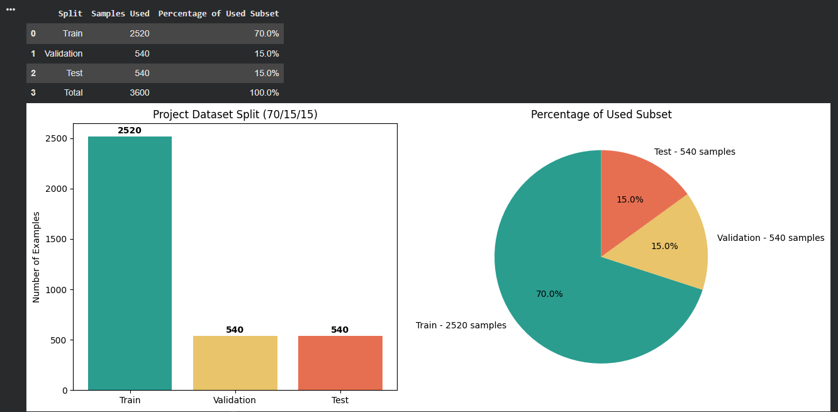
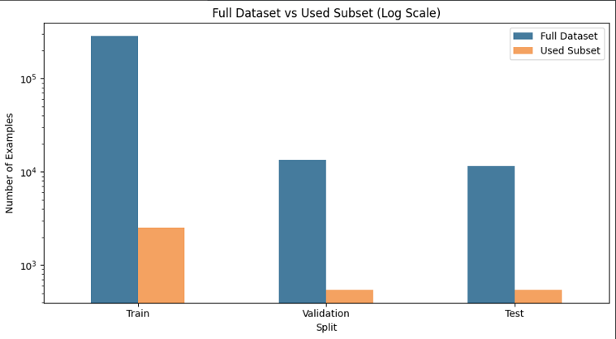
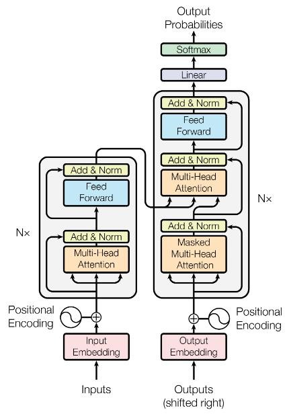
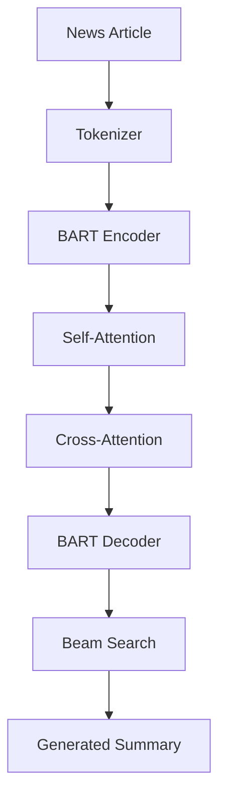
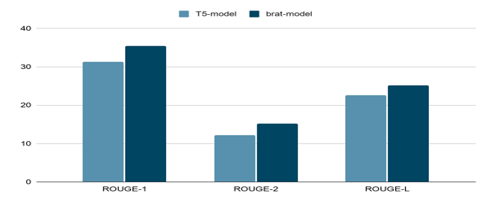
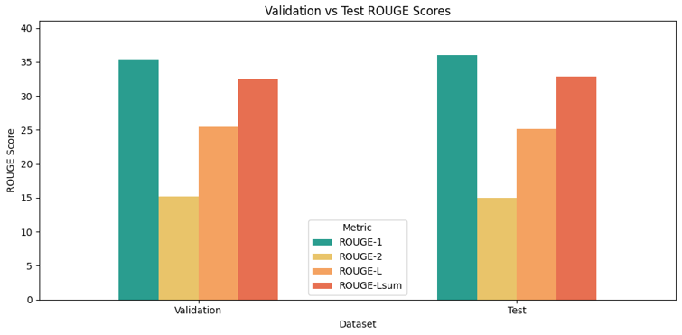
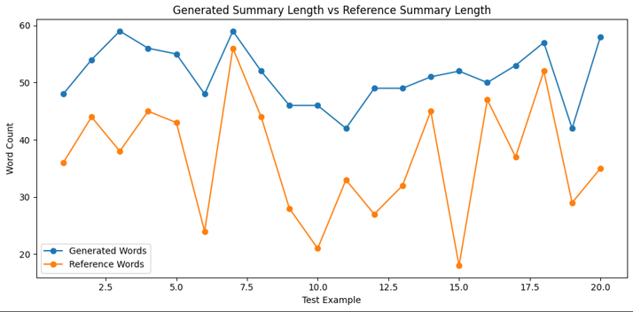
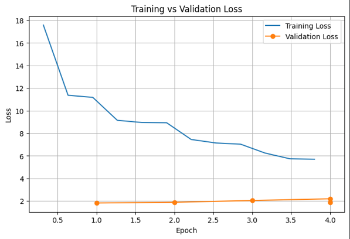
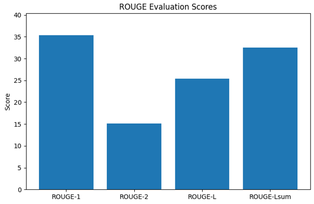
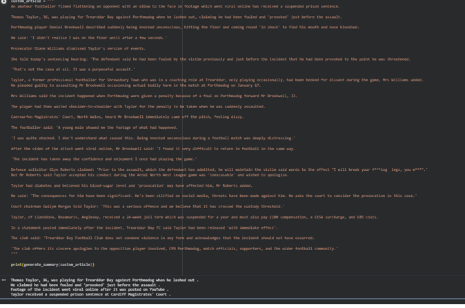

# Text-Summarization-Transformer-BART

> Abstractive Text Summarization System using the BART-large-CNN Transformer model fine-tuned on the CNN/DailyMail dataset to generate concise, coherent, and fluent news summaries.

---

## Project Overview

With the exponential growth of online content, users face an increasing challenge in consuming large volumes of textual information efficiently. News articles, reports, and documents often contain valuable information but require significant reading time.

This project presents an **Abstractive Text Summarization System** based on the **BART-large-CNN Transformer model**, capable of automatically generating concise summaries from lengthy news articles while preserving their key information and overall meaning.

The model was trained and evaluated using the **CNN/DailyMail Dataset**, a widely recognized benchmark for text summarization research.

---

## Problem Statement

The modern world generates an overwhelming amount of textual data every day.

* More than 2.5 million news articles are published daily.
* Reading lengthy articles is time-consuming.
* Users need fast access to essential information.

The goal of this project is to develop a Transformer-based summarization model that:

* Reduces reading time.
* Preserves important information.
* Produces coherent and human-readable summaries.
* Automates the summarization process.

---

## Dataset

This project uses the **CNN/DailyMail Dataset**, one of the most popular datasets for abstractive text summarization.

### Dataset Overview



### Dataset Statistics

| Split      | Samples | Percentage |
| ---------- | ------: | ---------: |
| Train      | 287,113 |        92% |
| Validation |  13,368 |         4% |
| Test       |  11,490 |         4% |

### Dataset Subset Used

Due to computational and memory limitations in Google Colab, a representative subset was selected for training and evaluation.

| Split      | Samples |
| ---------- | ------: |
| Train      |   2,520 |
| Validation |     540 |
| Test       |     540 |

### Full Dataset vs Used Subset



### Dataset Characteristics

| Feature                | Value                     |
| ---------------------- | ------------------------- |
| Source                 | CNN & DailyMail           |
| Task                   | Abstractive Summarization |
| Input                  | News Articles             |
| Output                 | Human-Written Highlights  |
| Average Article Length | ~800 Words                |
| Average Summary Length | ~55 Words                 |

---

## Transformer Architecture

The model is based on the **BART-large-CNN** architecture, a sequence-to-sequence Transformer model that combines:

* Bidirectional Encoder
* Autoregressive Decoder
* Self-Attention Mechanism
* Cross-Attention Mechanism
* Beam Search Decoding

### Transformer Encoder



### Architecture Workflow



---

## Why BART-large-CNN?

The BART-large-CNN model was selected because:

* It is specifically optimized for summarization tasks.
* It performs exceptionally well on CNN/DailyMail.
* It combines strong language understanding and text generation capabilities.
* It generates more coherent summaries than smaller Transformer models.
* It leverages transfer learning through pretrained weights.

---

## Training Strategy

The model was fine-tuned using a stable Transformer training configuration.

### Training Configuration

| Parameter              | Value                   |
| ---------------------- | ----------------------- |
| Model                  | facebook/bart-large-cnn |
| Optimizer              | AdamW                   |
| Learning Rate          | 2e-5                    |
| Scheduler              | Linear Decay            |
| Warmup                 | Enabled                 |
| Early Stopping         | Enabled                 |
| Gradient Checkpointing | Enabled                 |
| Evaluation Metric      | ROUGE-L                 |
| Decoding Method        | Beam Search             |

### Training Features

* Fine-tuning pretrained BART weights.
* Memory optimization using gradient checkpointing.
* Early stopping to prevent overfitting.
* ROUGE-L-based model selection.
* Beam search decoding for summary generation.

---

## Evaluation Metrics

The model performance was measured using the ROUGE family of evaluation metrics.

| Metric  | Description                |
| ------- | -------------------------- |
| ROUGE-1 | Unigram Overlap            |
| ROUGE-2 | Bigram Overlap             |
| ROUGE-L | Longest Common Subsequence |

These metrics compare generated summaries against reference summaries written by humans.

---

## Model Comparison

A comparison was conducted between BART and T5 models.

### BART vs T5 Performance



The comparison demonstrates the effectiveness of BART-large-CNN for news summarization tasks on the CNN/DailyMail dataset.

---

## Results

### Validation vs Test ROUGE Scores



---

### Generated Summary Length vs Reference Summary Length



---

### Training vs Validation Loss



---

### ROUGE Evaluation Scores



---

### Example: Generated Summary

The following example demonstrates the model's ability to summarize a complete news article into a concise and meaningful summary.



---

## Technologies Used

| Category                | Tools                     |
| ----------------------- | ------------------------- |
| Programming Language    | Python                    |
| Deep Learning Framework | PyTorch                   |
| Transformer Library     | Hugging Face Transformers |
| Dataset Library         | Hugging Face Datasets     |
| Evaluation              | ROUGE                     |
| Data Processing         | NumPy, Pandas             |
| Visualization           | Matplotlib                |
| Development Environment | Google Colab              |

---

## Repository Structure

```text
Text-Summarization-Transformer-BART/
│
├── model_design.ipynb
├── README.md
│
└── images/
    ├── DailyMail_Dataset.png
    ├── fullDatasetVsUsedSubset.png
    ├── TransformerEncoder.png
    ├── ComparisonBetween_T5_vs_BART.png
    ├── Rseults1_ValidationVsTestRougeScores.png
    ├── Rseults2_chartGeneratedSummaryLengthVsRefrenceSummaryLength.png
    ├── Rseults3_TrainingVsValidationLoss.png
    ├── Rseults4_ROUGEEvaluationScores.png
    └── Rseults5_gievnArticlethensummarized.png
```

---
